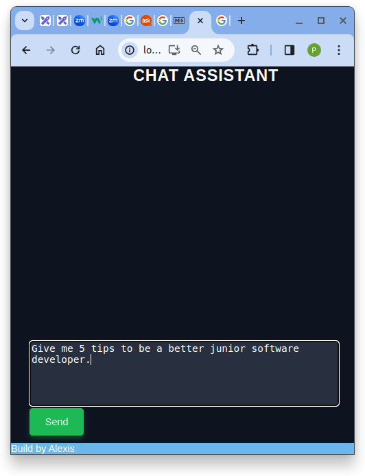

# Chat Assistant

This project was made as a learning experience to practice and showcase my knowledge.

## Features:

Backend server made in **Node.js**:
- POST **/gpt3** (send a message to OpenAI model gpt-3.5-turbo-1106)
- POST **/gpt4** (send a message to OpenAI model gpt-4-1106-preview, this will respond with a stream)
- POST **/dalle** (send a detailed message to ask OpenAI model to create an image)
- POST **/instruct** (send a message to OpenAI model gpt-3.5-turbo-instruct)
- POST **/recipe** (send an ingredient list and OpenAI model gpt-3.5-turbo-instruct will respond with a formated recipe )
- POST **/weather** (receive weather forecast for a city)
- POST **/whatsapp?:number** (send a Whatsapp message from the server mobile number to your chosen number)
- GET **/** (serves the index.html)   
- GET **/chat** (serves my React App chat)

**index.html** - built using DOM manipulation to showcase this node API calls and display the information.

**React** APP that connects to this Node.js API to make requests to OpenAI and receive responses in a fluid manner.
 - markdown react library
 - highlight library to display code blocks in a stylish way

**Stream.js**:
- Node.js server using Node-media-server to stream content, for example with OBS streaming software.

**Vision.js** :
- small app that uses OpenAI vision model (gpt-4-vision-preview) to play Pokemon Red.
- It sends a screenshot from the state of the game and asks which button to press next.
- AI gives the response back as a JSON object with properties of button and a message with the thought process.
- Writes the button to press in a text file (button.txt).
- Emulator running the game and the pokemon.lua script will read the file and press the button.

   
     
